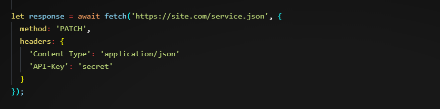
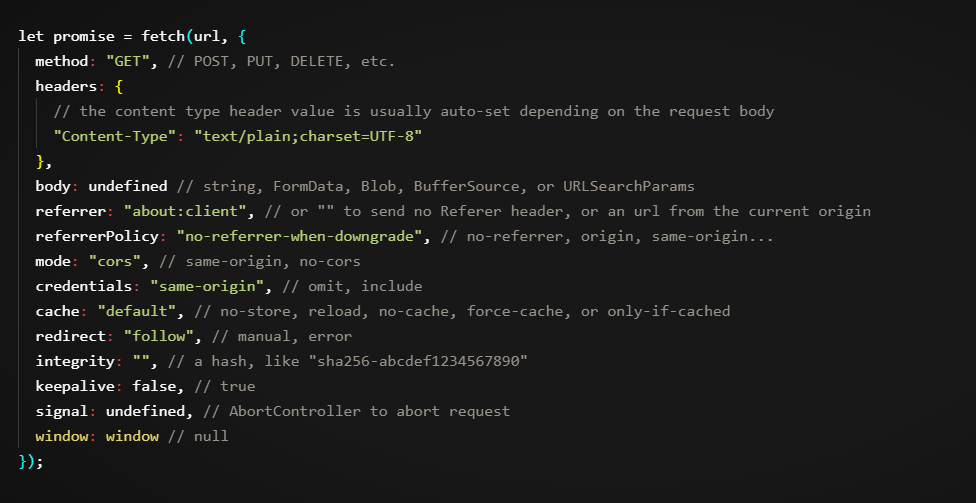

# Fetch:Cross Origin Request
Cross-origin requests – those sent to another domain (even a subdomain) or protocol or port – require special headers from the remote side. That policy is called “CORS”: Cross-Origin Resource Sharing.

+ If we make a fetch from an arbitrary web-site, that will probably fail.

+ The core concept here is origin – a domain/port/protocol triplet.

Because cross-origin restrictions protect the internet from evil hackers.

Seriously. Let’s make a very brief historical digression.

For many years a script from one site could not access the content of another site.

That simple, yet powerful rule was a foundation of internet security. E.g. a script from the page hacker.com could not access the user’s mailbox at gmail.com. People felt safe.

JavaScript also did not have any special methods to perform network requests at that time. It was a toy language to decorate a web page.

But web developers demanded more power. A variety of tricks were invented to work around the limitation.

## Using forms

One way to communicate with another server was to submit a <form> there. People submitted it into <iframe>, just to stay on the current page

So, it was possible to make a GET/POST request to another site, even without networking methods. But as it’s forbidden to access the content of an <iframe>from another site, it wasn’t possible to read the response.

As we can see, forms allowed to send data anywhere, but not receive the response. To be precise, there were actually tricks for that (required special scripts at both the iframe and the page), but let these dinosaurs rest in peace.

## Simple Request
There are two types of cross-domain requests:

+ Simple requests and non-simple request

+ ## Simple Request
A simple request is a request that satisfies two conditions:

Simple method: GET, POST or HEAD

Simple headers – the only allowed custom headers are:

Accept,
Accept-Language,
Content-Language,
Content-Type with the value application/x-www-form-urlencoded, multipart/form-data or text/plain.

+ ## Non-simple reques(any other request)

Requests with non-standard headers or e.g. method DELETE can’t be created this way. For a long time, JavaScript was unable to do such requests. So an old server may assume that such requests come from a privileged source, “because a webpage is unable to send them”.

When we try to make a non-simple request, the browser sends a special “preflight” request that asks the server – does it agree to accept such cross-origin requests, or not?

And, unless the server explicitly confirms that with headers, a non-simple request is not sent.

<b>The essential difference is that a “simple request” can be made with a <form> or a <script>, without any special methods.</b>

simple requests follow a set of specific conditions and can be sent directly, while non-simple requests require a preflight request to ensure they are safe and allowed by the server.

 more content <../ZPics/simple vs non-simple.md>

 ## Response Headers

 For cross-origin request, by default JavaScript may only access “simple response headers”:

Cache-Control
Content-Language
Content-Type
Expires
Last-Modified
Pragma

Any other response header is forbidden.

Please note: no Content-Length

Please note: there’s no Content-Length header in the list!

This header contains the full response length. So, if we’re downloading something and would like to track the percentage of progress, then additional permission is required to access that header (see below).

To grant JavaScript access to any other response header, the server must list it in the Access-Control-Expose-Headers header.

For example:

200 OK
Content-Type:text/html; charset=UTF-8
Content-Length: 12345
API-Key: 2c9de507f2c54aa1
Access-Control-Allow-Origin: https://javascript.info
Access-Control-Expose-Headers: Content-Length,API-Key

With such Access-Control-Expose-Headersheader, the script is allowed to access Content-Length and API-Key headers of the response.

## Non-Simple request

We can use any HTTP-method: not just GET/POST, but also PATCH, DELETE and others.

Some time ago no one could even assume that a webpage is able to do such requests. So there may exist web services that treat a non-standard method as a signal: “That’s not a browser”. They can take it into account when checking access rights.

So, to avoid misunderstandings, any “non-simple” request – that couldn’t be done in the old times, the browser does not make such requests right away. Before it sends a preliminary, so-called “preflight” request, asking for permission.

A preflight request uses method OPTIONS and has nobody.

Access-Control-Request-Method header has the requested method.
Access-Control-Request-Headers header provides a comma-separated list of non-simple HTTP-headers.
If the server agrees to serve the requests, then it should respond with status 200, without body.

The response header Access-Control-Allow-Methods must have the allowed method.
The response header Access-Control-Allow-Headers must have a list of allowed headers.
Additionally, the header Access-Control-Max-Age may specify a number of seconds to cache the permissions. So the browser won’t have to send a preflight for subsequent requests that satisfy given permissions.

here are three reasons why the request is not simple (one is enough):

Method PATCH

Content-Type is not one of: application/x-www-form-urlencoded, multipart/form-data, text/plain.

“Non-simple” API-Key header.

Step 1 (preflight request)

Prior to sending our request, the browser, on its own, sends a preflight request that looks like this:

OPTIONS /service.json
Host: site.com
Origin: https://javascript.info
Access-Control-Request-Method: PATCH

Access-Control-Request-Headers: Content-Type,API-Key

Method: OPTIONS.
The path – exactly the same as the main request: /service.json.
Cross-origin special headers:
Origin – the source origin.
Access-Control-Request-Method – requested method.
Access-Control-Request-Headers – a comma-separated list of “non-simple” headers.
Step 2 (preflight response)

The server should respond with status 200 and headers:

Access-Control-Allow-Methods: PATCH
Access-Control-Allow-Headers: Content-Type,API-Key.
That allows future communication otherwise, an error is triggered.

If the server expects other methods and headers in the future, makes sense to allow them in advance by adding to the list:

200 OK
Access-Control-Allow-Methods: PUT,PATCH,DELETE
Access-Control-Allow-Headers: API-Key,Content-Type,If-Modified-Since,Cache-Control
Access-Control-Max-Age: 86400

Now the browser can see that PATCH is in the list of allowed methods, and both headers are in the list too, so it sends out the main request.

Besides, the preflight response is cached for time, specified by Access-Control-Max-Age header (86400 seconds, one day), so subsequent requests will not cause a preflight. Assuming that they fit the allowances, they will be sent directly.

Step 3 (actual request)

When the preflight is successful, the browser now makes the real request. Here the flow is the same as for simple requests.

The real request has Origin header (because it’s cross-origin):

PATCH /service.json
Host: site.com
Content-Type: application/json
API-Key: secret
Origin: https://javascript.info

Step 4 (actual response)

The server should not forget to add Access-Control-Allow-Origin to the response. A successful preflight does not relieve from that:

Access-Control-Allow-Origin: https://javascript.info

Now everything’s correct. JavaScript is able to read the full response.

Please note:

Preflight request occurs “behind the scenes”, it’s invisible to JavaScript.

JavaScript only gets the response to the main request or an error if there’s no server permission.
# Fetch Api

rest of API 
An impressive list, right?

We fully covered the method, headers, and body in the chapter Fetch.

The signal option is covered in Fetch: Abort.

Now let’s explore the rest of  the options.

referrer, referrerPolicy

These options govern how fetch sets HTTP Refererheader.

That header contains the URL of the page that made the request. In most scenarios, it plays a very minor informational role, but sometimes, for security purposes, it makes sense to remove or shorten it.

The referrer option allows to set any Refererwithin the current origin) or disable it.

To send no referer, set an empty string:

To set another URL within the current origin:

The referrerPolicy option sets general rules forReferer.

Possible values are described in the Referrer Policy specification:

"no-referrer-when-downgrade" – default value: Referer is sent always, unless we send a request from HTTPS to HTTP (to less secure protocol).
"no-referrer" – never send Referer.
"origin" – only send the origin in Referer, not the full page URL, e.g. http://site.com instead of http://site.com/path.
"origin-when-cross-origin" – send full Referer to the same origin, but only the origin part for cross-origin requests.
"same-origin" – send full Referer to the same origin, but no referer for for cross-origin requests.
"strict-origin" – send only origin, don’t send Referer for HTTPS→HTTP requests.
"strict-origin-when-cross-origin" – for same-origin send full Referer, for cross-origin send only origin, unless it’s HTTPS→HTTP request, then send nothing.
"unsafe-url" – always send full url in Referer.
Let’s say we have an admin zone with URL structure that shouldn’t be known from outside of the site.

If we send a cross-origin fetch, then by default it sends the Referer header with the full URL of our page (except when we request from HTTPS to HTTP, then no Referer).

E.g. Referer: https://javascript.info/admin/secret/paths.

If we’d like to totally hide the referrer:

fetch('https://another.com/page', {

  referrerPolicy: "no-referrer" // no Referer, same effect as referrer: ""

});

Otherwise, if we’d like the remote side to see only the domain where the request comes from, but not the full URL, we can send only the “origin” part of it:

fetch('https://another.com/page', {

  referrerPolicy: "strict-origin" // Referer: https://javascript.info

});

mode

The mode option serves as a safe-guard that prevents cross-origin requests:

"cors" – the default, cross-origin requests are allowed, as described in Fetch: Cross-Origin Requests,
"same-origin" – cross-origin requests are forbidden,
"no-cors" – only simple cross-origin requests are allowed.
That may be useful in contexts when the fetch url comes from 3rd-party, and we want a “power off switch” to limit cross-origin capabilities.

credentials

The credentials option specifies whether fetch should send cookies and HTTP-Authorization headers with the request.

"same-origin" – the default, don’t send for cross-origin requests,
"include" – always send, requires Accept-Control-Allow-Credentials from the cross-origin server,
"omit" – never send, even for same-origin requests.
cache

By default, fetch requests make use of standard HTTP-caching. That is, it honors Expires, Cache-Control headers send If-Modified-Since, and so on. Just like regular HTTP-requests do.

The cache options allow to ignore HTTP-cache or fine-tune its usage:

"default" – fetch uses standard HTTP-cache rules and headers;
"no-store" – totally ignore HTTP-cache, this mode becomes the default if we set a header If-Modified-Since, If-None-Match, If-Unmodified-Since, If-Match, or If-Range;
"reload" – don’t take the result from HTTP-cache (if any), but populate cache with the response (if response headers allow);
"no-cache" – create a conditional request if there is a cached response, and a normal request otherwise. Populate HTTP-cache with the response;
"force-cache" – use a response from HTTP-cache, even if it’s stale. If there’s no response in HTTP-cache, make a regular HTTP-request, behave normally;
"only-if-cached" – use a response from HTTP-cache, even if it’s stale. If there’s no response in HTTP-cache, then error. Only works when the mode is "same-origin".
redirect

Normally, fetch transparently follows HTTP-redirects, like 301, 302, etc.

The redirect option allows to change that:

"follow" – the default, follow HTTP-redirects,
"error" – error in case of HTTP-redirect,
"manual" – don’t follow HTTP-redirect, but response.url will be the new URL, and response.redirected will be true, so that we can perform the redirect manually to the new URL (if needed).
integrity

The integrity option allows to check if the response matches the known-ahead checksum.

As described in the specification, supported hash-functions are SHA-256, SHA-384, and SHA-512, there might be others depending on a browser.

For example, we’re downloading a file, and we know that it’s SHA-256 checksum is “abc” (a real checksum is longer, of course).

We can put it in the integrity option, like this:

fetch('http://site.com/file', {

  integrity: 'sha256-abd'

});

Then fetch will calculate SHA-256 on its own and compare it with our string. In case of a mismatch, an error is triggered.

keepalive

The keepalive option indicates that the request may outlive the page.

For example, we gather statistics about how the current visitor uses our page (mouse clicks, page fragments he views), to improve user experience.

When the visitor leaves our page – we’d like to save it on our server.

We can use window.onunload for that:

window.onunload = function() {

  fetch('/analytics', {

    method: 'POST',git log

    body: "statistics",

    keepalive: true

  });

};

Normally, when a document is unloaded, all associated network requests are aborted. But the keepalive option tells the browser to perform the request in background, even after it leaves the page. So it’s essential for our request to succeed.

We can’t send megabytes: the body limit for keepalive requests is 64kb.
If we gather more data, we can send it out regularly, then there won’t be a lot for the “onunload” request.
The limit is for all currently ongoing requests. So we cheat it by creating 100 requests, each 64kb.
We don’t get the server response if the request is made onunload, because the document is already unloaded at that time.
Usually, the server sends an empty response to such requests, so it’s not a problem
 

